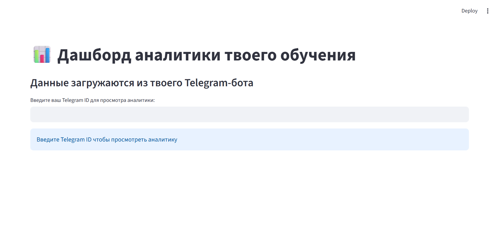
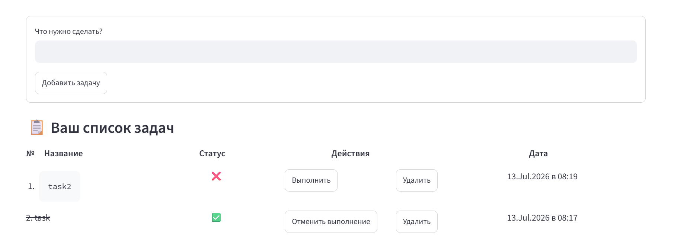

# Telegram TODO Bot

Simple Telegram-bot and website for managing a personal task list. Tasks for users are stored in the database `baza.db`.


## Project structure


               _________user___________
               |                      |
               |                      |
               |                      |
            website                  bot
               |                      |
               |                      |
               |______________________|
                           |
                           |
            ____________baza.db___________
            |                            |
            |      users      tokens     |
            |        |                   |
            |      tasks                 |
            |____________________________|

  

                           
## Features

- Add a task
- Show the task list
- Delete a task by number or text
- Mark a task as done or undone
- Clear all tasks
- Activate / deactivate the bot for the user
- Find out your telegram id
- Show available commands

## Installation

1. Clone the repository or copy the files into your project folder.
2. Install dependencies:

```bash
pip install pyTelegramBotAPI python-dotenv streamlit streamlit_cookies_controller pandas plotly
```

3. Create a `.env` file in the project root and add your bot token:

```env
TOKEN=your_bot_token
```

## Usage

```bash
python main.py
python -m streamlit run website.py
```

After starting, the bot will run and accept commands.

## Bot Commands

- `/start` — register the user and activate the bot
- `/add <task text>` — add a new task
- `/tasks` — display the current task list
- `/delete <task number or text>` — remove a task
- `/done <task number or text>` — mark a task as done
- `/undone <task number or text>` — mark a task as undone
- `/clear` — remove all tasks
- `/my_id` — find out your telegram id
- `/help` — show all commands
- `/stop` — deactivate the bot for the current user

## Examples

- Add a task:
  `/add Buy bread`
- View tasks:
  `/tasks`
- Delete a task by number:
  `/delete 2`
- Mark a task done:
  `/done 1`

## Website

 After the telegram id is entered the website will show analystics.



## Website buttons

You can also interact with tasks on the website after adding at least one of them via the bot.

- `Добавить задачу` — add a new task
- `Выполнить` — mark a task as done
- `Отменить выполнение` — mark a task as undone
- `Удалить` — remove a task



## Data Storage

Tasks are saved in the data base. В tasks table, users are saved in the users table. Tables connect to each other through user id. There is also tokens table for safe saving on the website.

### Users table
- `id` — user numder in the table
- `telegram_id` — user telegram id
- `active` — whether the bot is active for the user
- `created_at` — user creation date

### Tasks table

- `id` — task number in the table
- `user_id` — user id
- `text` — task text
- `done` — task status
- `created_at` — task creation date

### Tokens table

- `id` — user numder in the table
- `telegram_id` — user telegram id
- `session_token` — user token
- `created_at` — token creation date

                 _____________users____________________
                |id | telegram_id | active | created_at|
                |___|_____________|________|___________|
                    |                                      _______________tokens________________________
                    |                                     |id | telegram_id | session_token | created_at|
                    |                                     |___|_____________|_______________|___________|
                    |   
           _________|______tasks__________________
          |id | user_id | text | done | created_at|
          |___|_________|______|______|___________|

## Notes

- Make sure the token in `.env` is correct.
- If `baza.db` does not exist yet, it will be created automatically.
